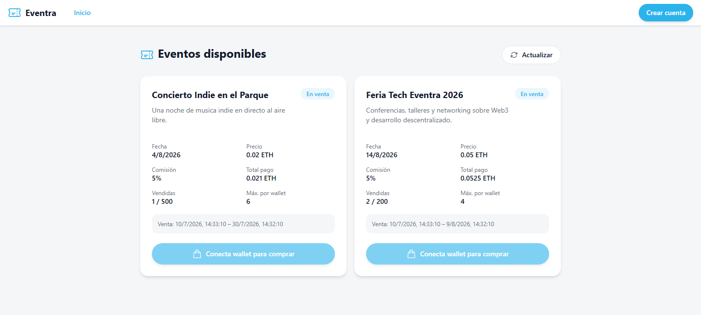
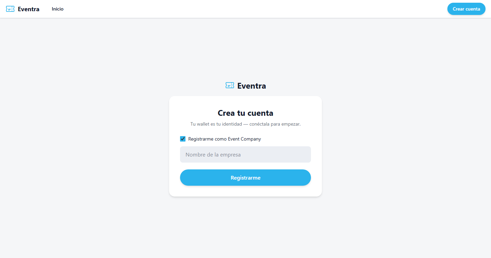
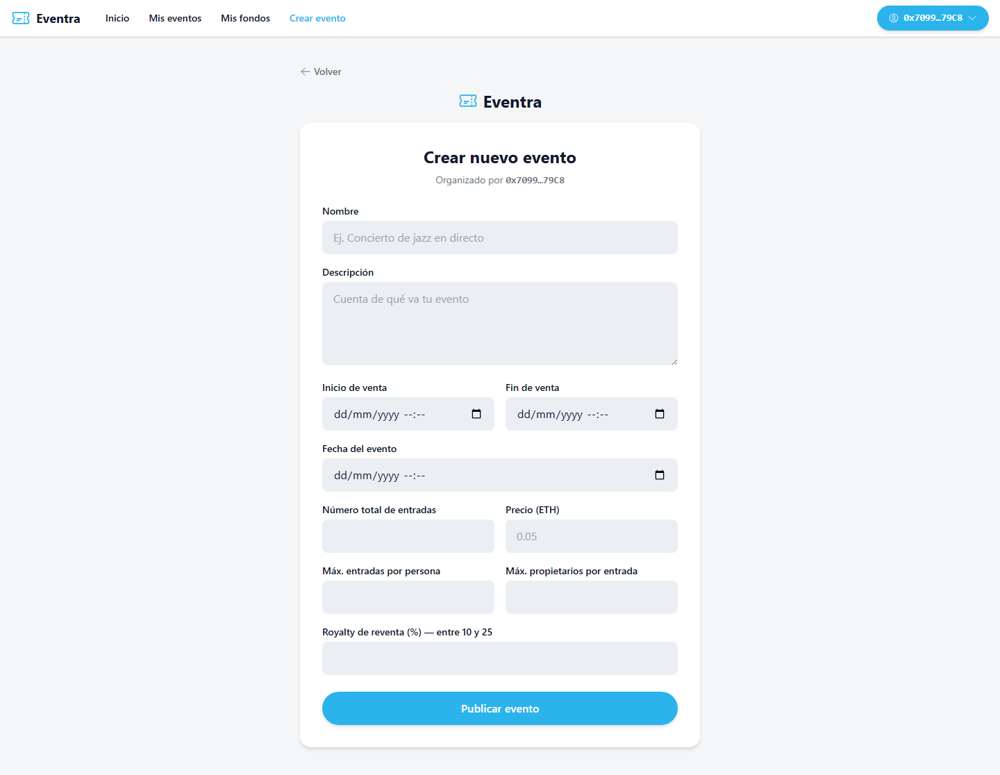
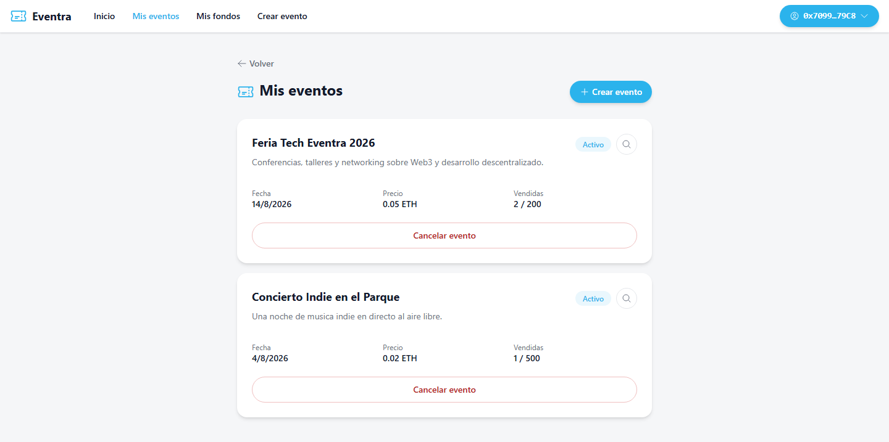
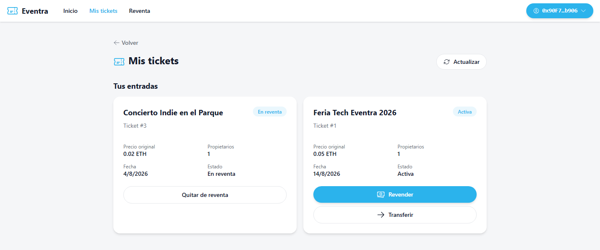
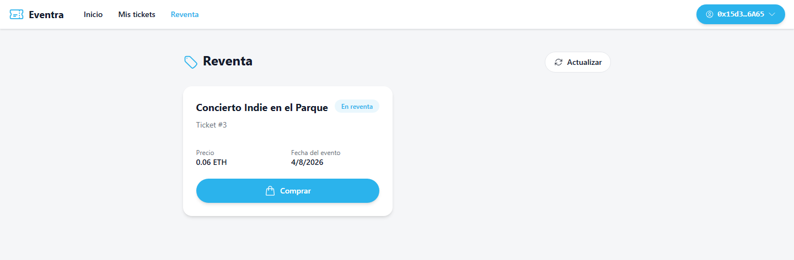
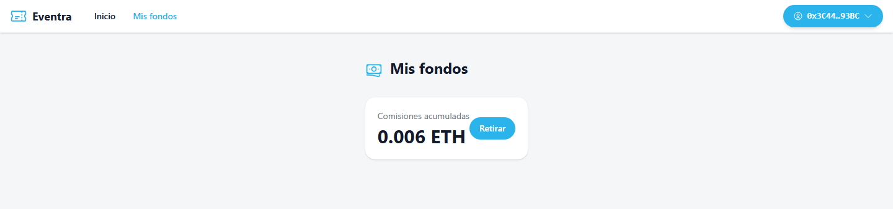
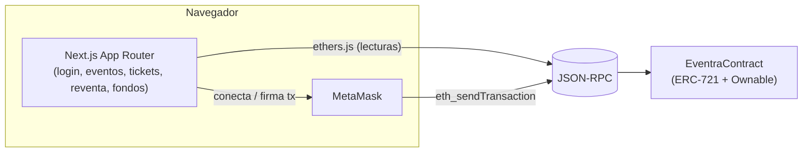

<div align="center">


# Eventra

**Venta y reventa de entradas para eventos, sobre un contrato inteligente ERC-721.**

Cada entrada es un NFT. La compra, la reventa con royalty para el organizador, las cancelaciones
y los reembolsos ocurren on-chain — el frontend es solo una ventana a ese estado.

[](packages/foundry/contracts/EventraContract.sol)
[](https://book.getfoundry.sh/)
[](packages/nextjs)
[](LICENCE)

</div>

---

## Índice

- [¿Qué es Eventra?](#qué-es-eventra)
- [Demo en vídeo](#demo-en-vídeo)
- [Capturas](#capturas)
- [Cómo funciona](#cómo-funciona)
- [El contrato `EventraContract`](#el-contrato-eventracontract)
- [Stack técnico](#stack-técnico)
- [Estructura del repositorio](#estructura-del-repositorio)
- [Requisitos](#requisitos)
- [Instalación y arranque local](#instalación-y-arranque-local)
- [Tests](#tests)
- [Scripts disponibles](#scripts-disponibles)
- [Despliegue a testnet/mainnet](#despliegue-a-testnetmainnet)
- [Licencia](#licencia)

## ¿Qué es Eventra?

Eventra es un **marketplace de entradas on-chain**. Una empresa organizadora crea un evento
pagando un depósito de garantía; los usuarios compran entradas (ERC-721) directamente al
contrato pagando en ETH; y esas entradas se pueden revender en un mercado secundario con un
royalty que vuelve al organizador — todo verificable en la blockchain, sin base de datos ni
backend intermedio.

El frontend (Next.js) habla con el contrato mediante **MetaMask + ethers.js**: no hay
localStorage haciendo de base de datos ni lógica de negocio duplicada en el cliente. Todo el
estado (quién es usuario, quién es empresa, qué entradas existen, quién las posee, qué hay en
reventa, qué fondos son retirables) vive en `EventraContract` y el frontend simplemente lo lee
y lo escribe.

**Roles:**

| Rol | Cómo se obtiene | Qué puede hacer |
|---|---|---|
| **Usuario** | `registerUser()` | Comprar entradas, transferirlas, ponerlas en reventa, comprarlas en reventa, pedir reembolso de entradas canceladas |
| **Empresa organizadora** | `registerCompany(nombre, address)` | Crear eventos (con depósito de 1 ETH), cancelarlos, retirar la recaudación tras el evento |
| **Owner del contrato** | Fijado en el despliegue | Suspender cuentas, retirar la comisión acumulada de la plataforma |

## Demo en vídeo

<video src="docs/demo.mp4" controls width="100%">
  Tu visor de Markdown no puede reproducir el vídeo embebido — descárgalo directamente desde
  <a href="docs/demo.mp4">docs/demo.mp4</a>.
</video>

> Si GitHub no reproduce el vídeo embebido en tu navegador, descárgalo desde
> [`docs/demo.mp4`](docs/demo.mp4).

## Capturas

<table>
<tr>
<td width="50%">

**Eventos disponibles**


</td>
<td width="50%">

**Alta de cuenta (usuario o empresa)**


</td>
</tr>
<tr>
<td width="50%">

**Crear evento (empresa)**


</td>
<td width="50%">

**Mis eventos (empresa)**


</td>
</tr>
<tr>
<td width="50%">

**Mis tickets (usuario)**


</td>
<td width="50%">

**Mercado de reventa**


</td>
</tr>
<tr>
<td width="50%">

**Fondos (owner / empresa / usuario)**


</td>
<td width="50%"></td>
</tr>
</table>

## Cómo funciona



No existe backend propio: las lecturas van directas al nodo por `NEXT_PUBLIC_RPC_URL` con un
`ethers.JsonRpcProvider`, y las escrituras pasan por la wallet del usuario (MetaMask) usando un
`ethers.BrowserProvider`. El hook [`useWallet`](packages/nextjs/hooks/eventra/useWallet.ts)
gestiona la conexión/desconexión, y [`utils/eventra/contract.ts`](packages/nextjs/utils/eventra/contract.ts)
centraliza la creación de las instancias de contrato y la traducción de los `revert` de Solidity
a mensajes en español.

## El contrato `EventraContract`

`packages/foundry/contracts/EventraContract.sol` — un ERC-721 (`"Eventra Tickets"`, símbolo
`EVTR`) donde cada `tokenId` es una entrada, más `Ownable` para las funciones de administración
de la plataforma.

**Estados de un evento** (`EventState`): `Active` → `SoldOut` / `Canceled` / `Finished`.
**Estados de una entrada** (`TicketState`): `Active` → `Transfered` / `inResell` / `Used` /
`Canceled` / `Reimbursed`.

**Parámetros y límites fijados en el contrato:**

| Parámetro | Valor |
|---|---|
| Depósito para crear un evento | `1 ether` (se devuelve si se cancela con antelación) |
| Royalty de reventa permitido | entre `10%` y `25%`, lo fija cada evento al crearse |
| Plazo de cancelación con devolución de depósito | `startSellDate - 1 día` |
| Comisión de la plataforma | fijada en el despliegue (`OWNER_COMMISSION`, inmutable) |

**Funciones principales:**

- `registerUser()` / `registerCompany(nombre, address)` — alta de cuentas.
- `createEvent(...)` — crea un evento pagando el depósito; valida fechas, precio, royalty, aforo.
- `buyTicket(eventId)` — compra una entrada nueva (mintea el NFT), paga precio + comisión.
- `putTicketInResell(tokenId, precio)` / `removeTicketFromResell(tokenId)` / `buyTicketFromResell(tokenId)` —
  mercado secundario; el organizador cobra el royalty configurado en cada reventa.
- `transferTicket(to, tokenId)` — transferencia directa entre usuarios registrados.
- `cancelEvent(eventId)` — cancela un evento; las entradas activas quedan reembolsables.
- `withdrawUserFunds` / `withdrawCompanyFunds` / `withdrawOwnerFunds` — retirada de reembolsos,
  recaudación del organizador (tras el evento + 1 día) y comisión acumulada de la plataforma.
- `suspendAccount(address)` — el owner puede suspender una cuenta (bloquea sus transferencias).

El contrato está cubierto por **94 tests** en
[`packages/foundry/test/EventraContract.t.sol`](packages/foundry/test/EventraContract.t.sol).

## Stack técnico

| | |
|---|---|
| **Contrato** | Solidity `^0.8.20`, [Foundry](https://book.getfoundry.sh/), OpenZeppelin (`ERC721`, `Ownable`) |
| **Frontend** | Next.js 15 (App Router), React 19, TypeScript, Tailwind CSS v4 |
| **Conexión a wallet** | [ethers.js v6](https://docs.ethers.org/v6/) + MetaMask (sin wagmi/RainbowKit) |
| **Monorepo** | npm workspaces |

## Estructura del repositorio

```
Eventra/
├── docs/
│   ├── demo.mp4                    # vídeo de demostración
│   └── screenshots/                # capturas usadas en este README
├── packages/
│   ├── foundry/                    # contrato inteligente (Forge)
│   │   ├── contracts/EventraContract.sol
│   │   ├── test/EventraContract.t.sol   # 94 tests
│   │   └── script/Deploy.s.sol
│   └── nextjs/                     # frontend (App Router)
│       ├── app/                    # /, /register, /events, /events/create,
│       │                           # /events/mine, /tickets, /resell, /funds
│       ├── components/Header.tsx   # navegación + modal de registro
│       ├── hooks/eventra/useWallet.ts
│       ├── utils/eventra/contract.ts    # conexión a MetaMask + parseo de errores
│       └── contracts/eventra.ts    # ABI + dirección desde variables de entorno
└── package.json                    # scripts raíz (delegan en cada workspace)
```

## Requisitos

- Node.js `>= 20.18.3` (incluye npm)
- [Foundry](https://book.getfoundry.sh/getting-started/installation) (`forge`, `anvil`, `cast`)
- [MetaMask](https://metamask.io/) (u otra wallet compatible con EIP-1193) en el navegador

## Instalación y arranque local

```bash
git clone <url-del-repositorio>
cd Eventra
npm install
```

`npm install` copia `packages/foundry/.env.example` a `.env` automáticamente (hook
`postinstall`); no hace falta rellenarlo para desarrollo local en Anvil.

**1. Levanta una cadena local:**

```bash
npm run chain
# equivalente a: anvil (RPC en http://127.0.0.1:8545, chain id 31337)
```

**2. Despliega el contrato** (en otra terminal), usando una de las cuentas de prueba que
imprime `anvil` al arrancar:

```bash
cd packages/foundry
forge script script/Deploy.s.sol \
  --rpc-url http://127.0.0.1:8545 \
  --broadcast \
  --private-key <private-key-de-una-cuenta-de-anvil>
```

El script imprime la dirección desplegada (`Eventra deployed to: 0x...`).

**3. Configura el frontend** creando `packages/nextjs/.env.local`:

```bash
NEXT_PUBLIC_EVENTRA_ADDRESS=<dirección-del-paso-2>
NEXT_PUBLIC_RPC_URL=http://127.0.0.1:8545
NEXT_PUBLIC_CHAIN_ID=31337
```

**4. Arranca el frontend:**

```bash
npm start   # next dev -> http://localhost:3000
```

Con eso ya puedes conectar MetaMask (añadiendo la red local de Anvil si no la tenías), crear una
cuenta de usuario o empresa, y probar el flujo completo: crear un evento, comprar una entrada,
ponerla en reventa, comprarla desde otra cuenta, y retirar fondos.

## Tests

```bash
npm test   # forge test — 94 tests sobre EventraContract
```

## Scripts disponibles

Ejecutados desde la raíz (delegan en el workspace correspondiente):

| Script | Descripción |
|---|---|
| `npm run compile` | Compila el contrato (`forge build`) |
| `npm test` | Corre los tests de Foundry |
| `npm run chain` | Levanta una cadena local (`anvil`) |
| `npm run deploy` | Despliega usando la configuración de cuentas de Foundry (ver `packages/foundry/script/Deploy.s.sol`) |
| `npm start` | Arranca el frontend en modo desarrollo (`next dev`) |
| `npm run next:build` | Build de producción del frontend |
| `npm run next:check-types` | Comprueba tipos (`tsc --noEmit`) |
| `npm run lint` | Lint de ambos paquetes |
| `npm run format` | Formatea ambos paquetes |

## Despliegue a testnet/mainnet

`foundry.toml` ya trae configurados los `rpc_endpoints` de las redes más comunes (Sepolia,
Arbitrum, Optimism, Polygon, Base, ...) a partir de `ALCHEMY_API_KEY`, y verificación en
Etherscan vía `ETHERSCAN_API_KEY`. Copia `packages/foundry/.env.example` a `.env`, rellena tus
claves y despliega con:

```bash
forge script script/Deploy.s.sol --rpc-url <red> --broadcast --verify
```

Después actualiza las variables `NEXT_PUBLIC_EVENTRA_ADDRESS`, `NEXT_PUBLIC_RPC_URL` y
`NEXT_PUBLIC_CHAIN_ID` del frontend con los datos de la red elegida.

## Licencia

[MIT](LICENCE)
